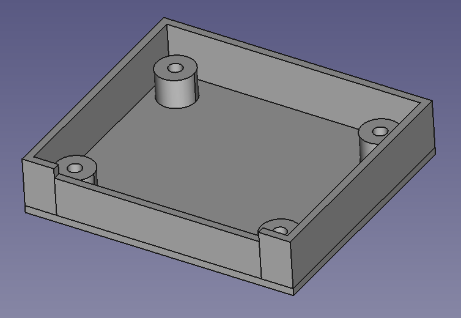
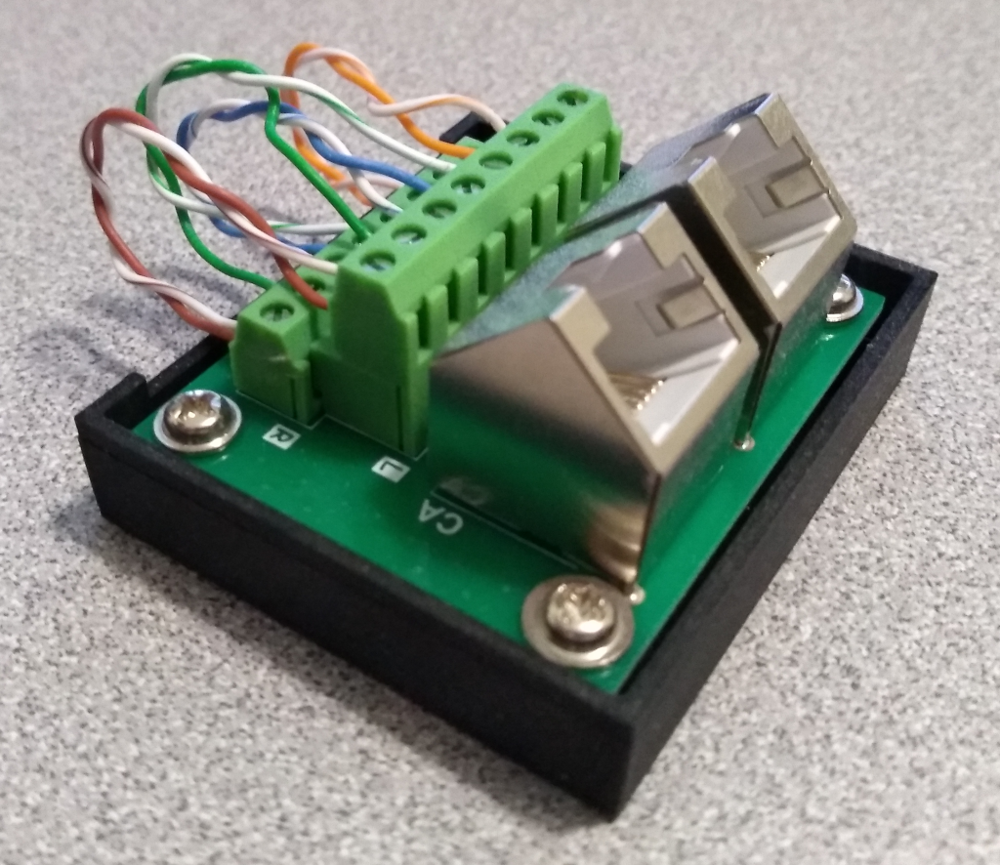

# Dual RJ45 Breakout Board Base

A 3D printable model used to create a base for a dual RJ45 breakout board.

The breakout board I was using for development work comes as an exposed PCB.
This model is a base to which the PCB can be mounted to protect the board 
from shorting out on the work bench.

Project includes the original FreeCAD file and an STL export for 3D slicing.

3D model in FreeCAD...

Resulting print with mounted breakout board...

